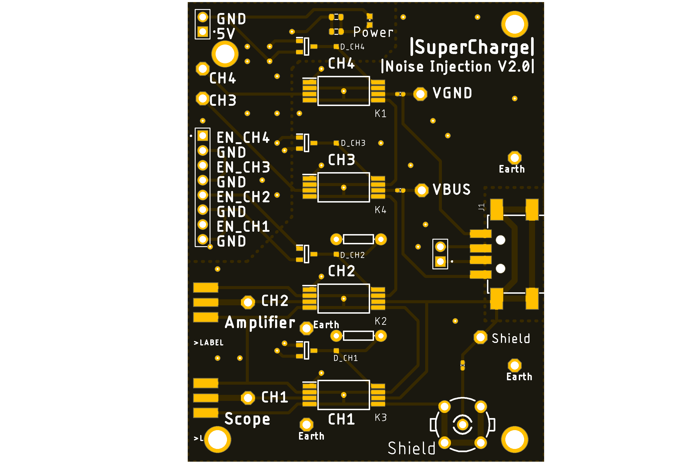

# PowerTouch

A Genetic Algorithm-based framework that can automatically generate `wired ghost touch attacks` given security objectives (e.g., types and locations of desired ghost touches).

## About this work

For more details, please refer to our **ICCAD'22** paper: [_PowerTouch: A Security Objective-Guided Automation Framework
for Generating Wired Ghost Touch Attacks on Touchscreens_](ICCAD2022_PowerTouch.pdf).

## Dependencies

### Software Dependencies

* Standard packages: `ctypes`, `numpy`, `re`, `datetime`, `pandas`, `warnings`, `matplotlib`, `statistics`, `time`


* Python Genetic Algorithm Library: [PyGAD](https://pygad.readthedocs.io/en/latest/)
  ```bash
  pip install pygad
  ```

* Android Debug Bridge (ADB): [Android SDK Platform Tools](https://developer.android.com/studio/releases/platform-tools).
  > Currently, the framework only supports Android devices. We will add support for iOS devices in the future.


* Clone this repository
  ```bash
  git clone https://github.com/xz-group/PowerTouch.git
  ```

### Hardware Dependencies

* `All-in-one USB instrument`: [Analog Discovery 2](https://digilent.com/shop/analog-discovery-2-100ms-s-usb-oscilloscope-logic-analyzer-and-variable-power-supply/) 
with [BNC Adapter board](https://digilent.com/shop/bnc-adapter-for-analog-discovery/).

  * Five instruments are implemented in Analog Discovery 2 for this framework: 
    * `oscilloscope`: to capture the TX excitation signal of the touchscreen and monitor the generated noise signal.
    * `waveform generator`: to generate the noise signal.
    * `pattern generator`: to generate digital control signals for the relays on the customized noise injection PCB.
    * `logic analyzer`: to monitor the above digital control signals.
    * `power supply`: to power the customized noise injection PCB.


* `High-voltage amplifier module`: we use [MX200 Piezo Driver](https://www.piezodrive.com/modules/mx200-high-performance-piezo-driver/) for this project.
  But any high-voltage amplifier module that can generate minimum 60Vpp signal with 500kHz bandwidth should work.
  >   The bandwidth of MX200 is 200KHz also. We extend the bandwidth to around 500KHz by calibrating the gain of the amplifier. See [here]() for details.


* Our `customized noise injection PCB`: source design files are available in [hardware](./hardware) folder.
  
  * The board is powered by 5V through `5V` and `GND` pins. 
  * It contains four RF relay ([9814-500 relay](https://www.digikey.com/en/products/detail/coto-technology/9814-05-00/586522)) channels: CH1, CH2, CH3, and CH4.
    * `CH1` is used to capture the TX excitation signal of the touchscreen. It is connected to the `SHIELD` of USB connector.
    * `CH2` is used to inject high-voltage noise signal to the touchscreen. It is connected to the `SHIELD` of USB connector.
    * `CH3` and `CH4` are used to charge the smartphone when conducting the experiments. They are connected to the `VBUS` and `VGND` of USB connector, respectively.
  * The relays are controlled through `EN_CH1`, `EN_CH2`, `EN_CH3`, `EN_CH4` pins, respectively. High enables (>=3.3V) the relays, and low disables the relays.
  * `CH1` and `CH2` are connected outside the PCB through `BNC` connectors. The `SMA` connectors. `SHIELD` is connected outside the PCB through `BNC` connectors. 


* `Power supply`: this is used to power the high-voltage amplifier module and charge the smartphone (if enable charging the phone feature). We use [Keithley 2231A-30-3 Triple-channel DC Power Supply](https://www.tek.com/en/products/keithley/dc-power-supplies/2220-2230-2231-series).


* `Metal sheet`: to be connected to the `EARTH` of the wall outlet. This is used to build the true ground plane for converting the noise from differential mode to common mode.
We use [this one](https://a.co/d/iU6o7kK) for this project.


## How to Use

Please refer to the example usage code in `PowerTouch/example_usage_code` folder for details.

## Citation

If you use this framework for your research, please cite our [ICCAD'22 paper](ICCAD2022_PowerTouch.pdf):

```
@inproceedings{zhu2022powertouch,
  title={PowerTouch: A Security Objective-Guided Automation Framework for Generating Wired Ghost Touch Attacks on Touchscreens},
  author={Zhu, Huifeng and Yu, Zhiyuan and Cao, Weidong and Zhang, Ning and Zhang, Xuan},
  booktitle={Proceedings of the 41st IEEE/ACM International Conference on Computer-Aided Design},
  pages={1--9},
  year={2022}
}
```

## Contact Information

If you have any questions regarding using this framework, please feel free to contact us at [zhuhuifeng@wustl.edu](mailto:zhuhuifeng@wustl.edu).

## Roadmap
- [ ] To be updated

## Version History

* 0.1
  * Initial Release

## License

This framework is licensed under the `GNU3` License - see the [LICENSE.md](LICENSE) file for details
